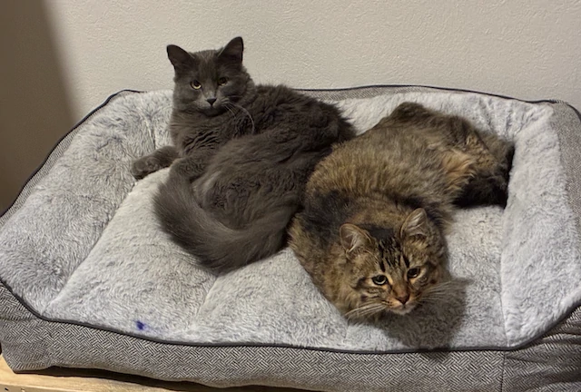
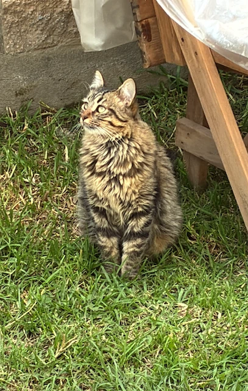
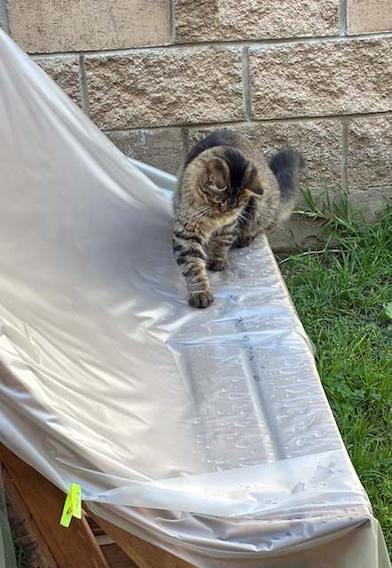
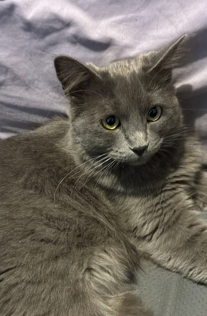
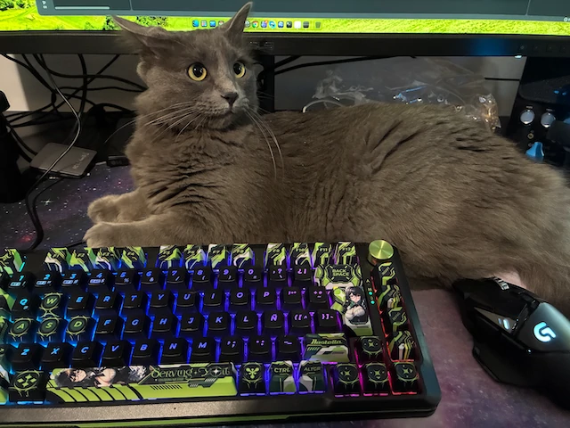
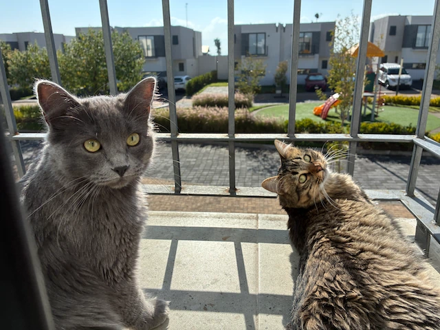
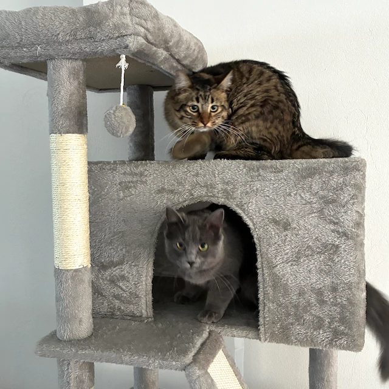

# Juri y Giorgio

Para empezar la nueva serie de publicaciones donde aprovecho el tiempo cuando mi mujer está viendo tiendas en el centro comercial.

Quiero presentar a mis gatitos de apoyo emocional, Giorgio un gatito macho atrigrado o Tabby, además de su hermana Juri: una gatita hembra color gris a la que le decimos de cariño «Peluza».

No son gatitos de raza, pero eso no significa que sean económicos, ya que aunque los adoptamos de una gatita callejera, los costos de sus vacunas, desparacitación y esterilización han superado los $7000 MXN, a veces duele el codo por gastar tanto pero al final lo vale pues son mis mascotas de compañia y apoyo emocional.

Giorgio es un gato gentil aunque tosco, es más apegado y cariñoso con mi señora Dulce Gaby, pues con ella vivió desde cachorro, era muy salvaje al inicio pero se hizo muy docil despues de castrarlo.

Tiene dos características come mucho y bebe el agua con sus patitas, es gracioso de ver pero deja el área cerca de su bebedero siempre salpicada, y el agua se ensucia constantemente con la tierra que trae en sus patitas. Esta segunda característica conlleva que le gusta el agua y mojarse, el primer gato de todos los que he tenido que le gusta.

Por otra parte esta Peluza (Juri) quien es una diva gatuna, la adoptamos antes que Giorgio desde muy pequeña y vivió la mayor parte de bebé con mi pareja. 

Es una gata que la mayor parte del tiempo no se va acercar a menos que quiera algo, pero siempre que su hermano Giorgio, o su primo Sanji maúllen con angustia, mi gatita Pelusa acude a ellos y los busca para hacerlos sentir mejor.

Las peculiaridades de pelusa, es su facilidad de enojo, cuando le hablas fuerte o le truenas los dedos se enoja de manera instantánea y la otra es que cuando la sacas a pasear no va a caminar por nada del mundo, pero si la cargas en brazos ira muy quieta y dosil observando todo.

Pelusa es más apegada a mi, pues después de pasar la mayor parte de bebé en casa de mi pareja, se quedo a vivir conmigo y mi papá, además de su primo Sanji. Responde cuando la llamo pero si no está de humor no se dejará tocar si no le apetece.

Actualmente ambos tienen 1 año de edad, y viven con nosotros, el destino y las circunstancias hicieron que los hermanos que vivieran con mi pareja y conmigo, pasaran de estar en casas diferentes a estar juntos bajo el mismo techo.

No se llevan mal, y juegan mucho entre ellos, sin embargo cada gato es un mundo diferente en su forma de ser y no siempre les gusta estar juntos, especialmente pelusa que le gusta descansar por su cuenta pero Giorgio siempre viene a alterar su paz.

Bueno por el momento es todo, aún están los viajes, las salidas a pasear y las monerías que hace cada uno, aunque eso lo agregaré en otras publicaciones, por el momento termino aquí mi primer post después de mucho tiempo.

Gracias por leer, y un abrazo hasta donde estés.
